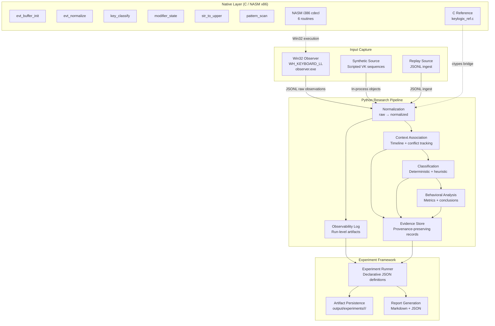

# KeyLogix

**Controlled Windows keylogger research project exploring low-level keystroke capture, Win32 API integration, native C/NASM components, background execution, process visibility, and endpoint-security detection research inside an isolated Windows laboratory environment.**

---

## Overview

KeyLogix is a security-research and adversary-emulation laboratory framework for studying the complete lifecycle of Windows keyboard-input capture—from low-level hook installation through event normalization, contextual analysis, behavioral measurement, evidence collection, and controlled endpoint-security observability experiments.

The project implements a **functional keylogger capture component** (`WH_KEYBOARD_LL` via `SetWindowsHookExW`) alongside a full research pipeline that processes, classifies, analyzes, and reports on captured keystroke data. All research is conducted with synthetic test data inside an isolated Windows 7 SP1 x86 virtual machine.

**Research positioning:** Aligned with MITRE ATT&CK T1056.001 (Keylogging) as a technique-under-study, not as an operational capability.

---

## Research Objectives

| Objective | Description |
|-----------|-------------|
| **Low-level capture** | Implement and study `WH_KEYBOARD_LL` keyboard hook behavior on Windows |
| **Event representation** | Define immutable, provenance-tracked event model (raw → normalized → derived) |
| **Context association** | Associate keystrokes with application/window context; track conflicts explicitly |
| **Classification** | Deterministic per-key categories (VK-based) + heuristic sequence labels |
| **Behavioral analysis** | Measure frequencies, intervals, bursts, repeats, context transitions |
| **Observability research** | Record artifacts, telemetry, and security-product exposure under controlled conditions |
| **Evidence & provenance** | Preserve experiment integrity with cryptographic identity and transformation lineage |
| **Reproducible experiments** | Declarative experiment definitions with expected/actual comparison |

---

## Why KeyLogix Exists

Keyboard-input capture is a foundational technique in both offensive security (credential theft, surveillance) and defensive research (behavioral detection, EDR telemetry). KeyLogix exists to **replace assumptions with measurements** by providing:

1. **A working capture implementation** — not a diagram, but actual `WH_KEYBOARD_LL` code that produces JSONL observations
2. **A separated pipeline** — capture, normalization, context, classification, analysis, evidence, and reporting are distinct, tested stages
3. **Low-level research components** — C reference and NASM x86 routines for performance-critical or ABI-stable operations
4. **Controlled visibility research** — the observer is intentionally visible (console banner, no hiding); its detectability is *measured*, not assumed
5. **Defender/EDR laboratory** — experiment definitions that can be executed on an isolated Windows 7 SP1 VM to record actual security-product responses
6. **Full reproducibility** — single-script verification from source to experiment artifacts

---

## Core Capabilities

| Capability | Implementation | Status |
|------------|----------------|--------|
| **Win32 low-level keyboard hook** | `native/win32/observer.c` — `WH_KEYBOARD_LL` via `SetWindowsHookExW` | Cross-compiled (`observer.exe`) |
| **Native C reference library** | `native/c/keylogix_ref.c` — 6 ABI functions | 68 tests pass |
| **NASM x86 assembly routines** | 6 routines in `native/asm/i386/*.asm` | Assembled to Win32 objects |
| **Python research pipeline** | `src/keylogix/` — 15 modules | 81 pytest tests pass |
| **Synthetic observation source** | In-process scripted events | Verified |
| **Replay ingestion** | JSONL raw observation replay with provenance tagging | Verified |
| **Context association** | Timeline-based with conflict retention | Verified |
| **Deterministic classification** | 9 VK categories (ordinary, modifier, navigation, control, function, lock, numpad, oem, unknown) | Verified |
| **Heuristic sequence labels** | `text_oriented`, `special_key_sequence`, `modifier_chord`, `mixed`, `empty` | Verified |
| **Behavioral analysis** | Frequency, intervals, bursts (≥5 events / 50 ms), repeats (≥3 / 100 ms), context changes | Verified |
| **Experiment runner** | 5 bundled experiments (EXP-001–005) | All execute and verify |
| **Evidence store** | Provenance-preserving JSONL with `information_kind` lineage | Verified |
| **Markdown reporting** | Structured experiment reports | Verified |

---

## Architecture



### Pipeline Stages (Information Kinds)

| Stage | Information Kind | Description |
|-------|------------------|-------------|
| 1. Capture | `raw_observation` | Direct output from observation source (Win32, synthetic, replay) |
| 2. Normalization | `normalized_observation` | Validated, typed events with deterministic key labels |
| 3. Context | `normalized_observation` | Same events, enriched with application/window context |
| 4. Classification | `derived_interpretation` / `heuristic_classification` | Per-key category (deterministic) + sequence label (heuristic) |
| 5. Analysis | `behavioral_analysis` | Measured metrics + labeled conclusions (`measured\|derived\|inferred\|hypothetical`) |
| 6. Observability | `observability` | Run-level metadata about the experiment itself |
| 7. Evidence | Multiple kinds | Structured records citing parent observations |

---

## Low-Level Windows Input Capture

### Mechanism: `WH_KEYBOARD_LL`

KeyLogix uses the Windows **low-level keyboard hook** (`WH_KEYBOARD_LL`) — the same mechanism used by legitimate accessibility tools and by keyloggers. This hook:

- Receives keystrokes **before** they reach the target window procedure
- Executes in the **installing process's context** (no DLL injection required)
- Provides `KBDLLHOOKSTRUCT` with `vkCode`, `scanCode`, `flags`, `time`, `dwExtraInfo`
- **Must** call `CallNextHookEx` to chain to the next hook (KeyLogix always does)

### Win32 APIs Used

| API | Purpose |
|-----|---------|
| `SetWindowsHookExW` | Install `WH_KEYBOARD_LL` hook |
| `CallNextHookEx` | Chain to next hook (mandatory) |
| `UnhookWindowsHookEx` | Clean removal on shutdown |
| `GetMessage` / `DispatchMessage` | Message loop on hook thread |
| `GetModuleHandle` | Module handle for hook installation |
| `CoCreateGuid` | Session UUID generation |
| `GetSystemTime` / `GetTickCount` | Timestamp sources |
| `SetConsoleCtrlHandler` | Ctrl+C graceful shutdown |

### Observer Binary (`observer.exe`)

| Property | Detail |
|----------|--------|
| **Language** | C11 (`native/win32/observer.c`) |
| **Target** | Windows 7 SP1 x86 (cross-compiled via MinGW-w64) |
| **Output** | JSON Lines (`raw.jsonl`) — one raw observation per line |
| **Visibility** | **Intentional**: stderr banner, console process, no hiding |
| **Hook lifetime** | Installs on start; unhooks on Ctrl+C, `WM_QUIT`, or `--duration-ms` expiry |
| **Event schema** | `keylogix.raw_observation.v1` with full `KBDLLHOOKSTRUCT` fields |
| **Provenance** | `information_kind: "raw_observation"`, `transform: "observe"` |

**CLI:**
```bash
observer.exe --session <uuid> --output raw.jsonl --duration-ms 15000
```

---

## Win32 API Layer

```
┌─────────────────────────────────────────────────────────────┐
│                    Windows Keyboard Input                   │
└──────────────────────────┬──────────────────────────────────┘
                           ▼
┌─────────────────────────────────────────────────────────────┐
│              WH_KEYBOARD_LL Hook Procedure                  │
│  (LowLevelKeyboardProc in observer.exe)                     │
│  • nCode == HC_ACTION                                       │
│  • wParam: WM_KEYDOWN / WM_KEYUP / WM_SYSKEYDOWN / WM_SYSKEYUP │
│  • lParam: KBDLLHOOKSTRUCT*                                 │
└──────────────────────────┬──────────────────────────────────┘
                           ▼
┌─────────────────────────────────────────────────────────────┐
│              JSONL Serialization                            │
│  • event_id (UUID4 via CoCreateGuid)                       │
│  • timestamp (UTC ISO-8601 via GetSystemTime)              │
│  • event_type: "" (raw); event_type_raw preserves message  │
│  • key_code: p->vkCode                                      │
│  • scan_code, flags, extra_info, tick_ms from KBDLLHOOKSTRUCT │
│  • monotonic_ns: tick_ms * 1,000,000                        │
│  • clock_source: "win32_filetime_utc+kbdll_tickms"         │
│  • source: "win32_llhook"                                   │
│  • modifier_state: unknown (not tracked in observer)       │
│  • application/window_title: unavailable                   │
└──────────────────────────┬──────────────────────────────────┘
                           ▼
┌─────────────────────────────────────────────────────────────┐
│              Python Pipeline Ingestion                      │
│  (ReplaySource → Pipeline → Normalization → ...)            │
└─────────────────────────────────────────────────────────────┘
```

The Python pipeline **never installs a hook**. The Win32 boundary is isolated to `observer.exe`, which writes JSONL. The pipeline ingests via `ReplaySource`, preserving provenance with `ingested_via: "replay"`.

---

## Native C Layer

The C reference implementation (`native/c/keylogix_ref.c`) provides the **analysis-host executable** specification for the native ABI. It is compiled as:

- Shared library: `libkeylogix_ref.so` (Linux analysis host)
- Static test harness: `test_native` (68 tests)
- Cross-compiled Win32 test harness: `test_native_win32.exe` (links NASM objects)

### ABI Functions (from `native/include/keylogix_abi.h`)

| Function | Signature | Purpose |
|----------|-----------|---------|
| `evt_buffer_init` | `int32_t(void* dest, uint32_t capacity)` | Initialize fixed-size event buffer header (16 bytes) |
| `evt_normalize` | `int32_t(const EvtRawPacked*, EvtNormPacked*)` | Stateless numeric normalization (no modifier invention) |
| `key_classify` | `int32_t(uint32_t vk_code)` | Deterministic VK → category ID (0–8) |
| `modifier_state` | `int32_t(uint32_t prior, uint32_t vk, uint32_t is_up)` | Update 4-bit modifier bitfield (Shift/Ctrl/Alt/Win) |
| `str_to_upper` | `int32_t(char* s, uint32_t len)` | In-place ASCII a–z → A–Z conversion |
| `pattern_scan` | `int32_t(const uint8_t*, uint32_t, const uint8_t*, uint32_t)` | Naive byte pattern search |

### Data Structures (packed, little-endian)

```c
// 16 bytes
typedef struct {
    uint32_t magic;      // KLX_BUF_MAGIC (0x314C4B58 = 'XKL1')
    uint32_t capacity;   // caller-provided max records
    uint32_t count;      // set to 0 by init
    uint32_t rec_size;   // sizeof(EvtRawPacked) = 20
} EvtBufferHeader;

// 20 bytes — matches Win32 KBDLLHOOKSTRUCT subset
typedef struct {
    uint32_t vk_code;
    uint32_t scan_code;
    uint32_t flags;      // LLKHF_* compatible; bit 7 = up
    uint32_t extra;
    uint32_t tick_ms;
} EvtRawPacked;

// 20 bytes — normalized representation
typedef struct {
    uint32_t event_type;     // 0 = KEY_DOWN, 1 = KEY_UP
    uint32_t key_code;
    uint32_t modifier_bits;  // 0 (native does not invent modifiers)
    uint32_t tick_ms;
    uint32_t class_id;       // key_classify(vk_code)
} EvtNormPacked;
```

### Error Codes

| Code | Constant | Meaning |
|------|----------|---------|
| 0 | `KLX_OK` | Success |
| -1 | `KLX_ERR_NULL` / `KLX_NOT_FOUND` | Null pointer or pattern not found |
| -2 | `KLX_ERR_INVALID` | Invalid argument (null with len>0, zero-length needle, etc.) |
| -3 | `KLX_ERR_NOSPACE` | Capacity out of range |
| -4 | `KLX_ERR_OVERFLOW` | Buffer overflow |
| -5 | `KLX_ERR_MAGIC` | Invalid buffer magic |

---

## NASM / x86 Assembly Layer

KeyLogix includes **six hand-written NASM routines** targeting **Windows 7 SP1 x86 (32-bit, cdecl calling convention)**. These are research components demonstrating:

- ABI-stable, compiler-independent implementations
- Direct translation of C logic to assembly for verification
- Minimal, auditable routines with no global state

| Routine | File | Role | Lines |
|---------|------|------|-------|
| `evt_buffer_init` | `evt_buffer_init.asm` | Initialize event buffer header | 45 |
| `evt_normalize` | `evt_normalize.asm` | Normalize raw packed → normalized packed | 73 |
| `key_classify` | `key_classify.asm` | VK → category (9 categories) | 157 |
| `modifier_state` | `modifier_state.asm` | 4-bit modifier bitfield update | 84 |
| `str_to_upper` | `str_to_upper.asm` | ASCII uppercase conversion | 61 |
| `pattern_scan` | `pattern_scan.asm` | Naive byte pattern search | 95 |

### Assembly Characteristics

| Property | Detail |
|----------|--------|
| **Architecture** | x86 32-bit (`BITS 32`) |
| **Calling convention** | cdecl (caller cleans stack) |
| **Registers** | `eax` return; `ebx, esi, edi, ebp` callee-saved |
| **Assembler** | NASM `-f win32` → `.obj` files |
| **Linking** | MinGW-w64 (`i686-w64-mingw32-gcc`) for Win32 test harness |
| **Validation** | Differential testing: C reference vs. NASM via `test_native_win32.exe` |

### Differential Testing

The repository validates C ↔ NASM parity by:

1. Compiling C reference → `libkeylogix_ref.so` (Linux) + `test_native` (68 tests)
2. Assembling NASM → `.obj` files (Win32 format)
3. Cross-compiling harness + NASM objects → `test_native_win32.exe`
4. Running both harnesses against identical test vectors

**Result:** 68 tests pass on both analysis-host C reference and Win32-linked NASM harness.

---

## Background Execution & Process Visibility

KeyLogix investigates how a keylogging component behaves when operating outside an interactive workflow:

| Aspect | Implementation |
|--------|----------------|
| **Interactive console** | `observer.exe` runs in a visible console window with banner |
| **Background execution** | Observer can run with `--duration-ms` and no user interaction |
| **Process type** | Ordinary user-mode process (no service, no kernel component) |
| **Hook threading** | Hook procedure executes on the installing thread's message loop |
| **Visibility** | **Not concealed**: appears in process list, has console, writes stderr banner |
| **Persistence** | **None** — no registry, no scheduled tasks, no startup folder |
| **Process hiding** | **None** — no DKOM, no unlinking, no API hooking of enumeration |
| **Injection** | **None** — hook runs in observer process only |

The research question is **observational**: *what artifacts does this visible process produce, and how do security products respond?* The project does not implement concealment features.

---

## Stealth and Visibility Research

KeyLogix treats **visibility as a measurable property**, not a design goal to minimize. The observer is deliberately visible:

- Console banner on stderr: `"KeyLogix — Win32 Low-Level Keyboard Observer (Laboratory)"`
- Process name: `observer.exe` (no masquerading)
- No hook chain manipulation beyond `CallNextHookEx`
- No anti-debug, anti-VM, or anti-analysis logic
- No timestomping, no log clearing, no forensic artifact removal

### What Is Measured

| Observable | How It Is Captured |
|------------|-------------------|
| Process creation | Visible in Process Explorer / Task Manager |
| Hook installation | `WH_KEYBOARD_LL` visible via `GetWindowsHookEx` enumeration (if inspected) |
| File I/O | `raw.jsonl` written to user-writable directory |
| Network | **None** — no sockets, no C2, no exfiltration |
| Persistence artifacts | **None** — no registry, no scheduled tasks |
| Memory injection | **None** — no `CreateRemoteThread`, no `WriteProcessMemory` |

### Research Methodology

Experiments on the Windows 7 SP1 VM can record:

1. **Baseline visibility** — what a standard user-mode `WH_KEYBOARD_LL` process looks like
2. **Security-product telemetry** — Defender/EDR events, ETW, sysmon if configured
3. **Behavioral signatures** — burst typing, modifier chords, context switching patterns
4. **Comparative variations** — synthetic vs. live hook; different hook durations; different key sequences

**No operational evasion techniques are implemented or documented.**

---

## Windows Defender / Endpoint-Security Research

### Laboratory Configuration

| Component | Specification |
|-----------|---------------|
| **Target OS** | Windows 7 SP1 x86 (isolated VM) |
| **Security product** | Microsoft Defender (or other EDR) — version and signature date recorded per experiment |
| **Network** | Host-only / no internet (snapshots only) |
| **Test data** | Synthetic only (e.g., `lab-password-not-real`) |

### Experiment Design

Each endpoint-security experiment records:

| Field | Description |
|-------|-------------|
| `security_product_state.present` | Explicit boolean — was a product running and telemetry available? |
| `security_product_state.identity` | Product name, version, signature date |
| `telemetry` | Observability log from the experiment run |
| `actual_observation` | Pipeline status, event counts, analysis results |
| `result` | Textual summary — **never claims "undetected"** |
| `limitations` | Explicit gaps (e.g., "Defender telemetry not accessible") |

### Critical Distinctions

| Claim | KeyLogix Standard |
|-------|-------------------|
| ❌ "Undetectable by Defender" | ❌ Never claimed |
| ❌ "Bypasses AV" | ❌ Never claimed |
| ✅ "No alert observed in EXP-XXX under Defender 4.18.x on Win7 SP1 with signatures YYYY-MM-DD" | ✅ Precisely this |
| ✅ "Telemetry showed process creation event ID 4688; no hook-specific alert" | ✅ Precisely this |
| ✅ "Detection status: INCONCLUSIVE — security product telemetry unavailable" | ✅ Precisely this |

> **The Linux-side build and research pipeline are reproducible; live Defender/EDR observations require execution inside the documented Windows 7 SP1 laboratory environment.**

---

## Event Processing Pipeline

### Data Flow

```
RawObservation (source: win32_llhook | synthetic | replay)
       │
       ▼
Normalizer.normalize_many()  ──→  List[NormalizedEvent] + failures
       │                               │
       │                               ▼
       │                        ContextAssociator.associate_many()
       │                               │
       ▼                               ▼
Classify.classify_many()          Classify.classify_sequence()
       │                               │
       ▼                               ▼
Analyzer.analyze()  ◄─────────────────┘
       │
       ▼
EvidenceStore + ObservabilityLog + Persistence
```

### Event Model (Canonical Fields)

| Field | Type | Description |
|-------|------|-------------|
| `event_id` | UUID4 string | Stable identity; reused from raw → normalized |
| `timestamp` | ISO-8601 UTC (µs) | Wall-clock observation time |
| `event_type` | `KEY_DOWN` \| `KEY_UP` | Normalized event type |
| `key_code` | int (0–255) | Win32 virtual-key code |
| `key_label` | OptionalField | Deterministic VK label (e.g., "A", "Shift", "F1") |
| `modifier_state` | ModifierState | 4-bit encoding + `known` + `origin` |
| `application` | OptionalField | Presence: observed/unavailable/not_applicable/derived |
| `window_title` | OptionalField | Same presence semantics |
| `session_id` | UUID4 string | Experiment session identifier |
| `source` | `synthetic` \| `win32_llhook` \| `unknown` | Originating mechanism |
| `monotonic_ns` | int | Monotonic nanoseconds for interval math |
| `clock_source` | string | `synthetic_clock`, `python_datetime_utc+perf_counter_ns`, `win32_filetime_utc+kbdll_tickms` |
| `provenance` | Provenance | `information_kind`, `transform`, `parent_ids`, `ingested_via` |

### OptionalField Presence Semantics

| Presence | Meaning | Value |
|----------|---------|-------|
| `observed` | Source provided it | String (empty allowed) |
| `derived` | Pipeline computed it | String + `obtained_via` |
| `unavailable` | Source could not provide | `null` |
| `not_applicable` | Not relevant to source | `null` |

**Missing context is never fabricated.**

---

## Data Model & Provenance

### Immutable, Typed Records

All core types are frozen dataclasses with validation in `__post_init__`. Transforms produce new objects; nothing mutates in place.

### Information Kind Lineage

```
raw_observation
      │
      ▼ (normalize)
normalized_observation
      │
      ├─► (context associate) ──► normalized_observation (enriched)
      │
      ├─► (classify event) ──► derived_interpretation  (deterministic, confidence=1.0)
      │
      ├─► (classify sequence) ─► heuristic_classification (confidence=0.7)
      │
      └─► (analyze) ──────────► behavioral_analysis (measured/derived/inferred/hypothetical)
```

### Evidence Record

```json
{
  "schema": "keylogix.evidence.v1",
  "record_id": "uuid4",
  "timestamp": "2026-09-18T12:34:56.123456Z",
  "source": "pipeline",
  "information_kind": "normalized_observation",
  "experiment_id": "EXP-001-synthetic-pipeline",
  "session_id": "uuid4",
  "event_id": "uuid4",
  "parent_ids": ["uuid4"],
  "observed": null,
  "derived": { "normalized_event": {...} },
  "classification": null,
  "confidence": 1.0,
  "notes": ""
}
```

---

## Behavioral Analysis

The analyzer produces a `BehavioralSummary` with measured metrics and explicitly typed conclusions.

### Measured Metrics

| Metric | Description |
|--------|-------------|
| `event_count` | Total events (down + up) |
| `key_down_count` / `key_up_count` | Directional counts |
| `unmatched_downs` / `unmatched_ups` | FIFO pairing by `key_code` |
| `duration_ns` | First → last `monotonic_ns` |
| `events_per_second` | Throughput |
| `mean_interarrival_ns` / `median_interarrival_ns` / `p95_interarrival_ns` | Interval statistics |
| `max_repeat_run` | Max consecutive same `key_code` down (< 100 ms) |
| `burst_count` | ≥5 downs with consecutive inter-arrival < 50 ms |
| `context_change_count` | Application/window transitions |
| `modifier_key_event_fraction` | Fraction of events with modifier category |
| `ordinary_key_event_fraction` | Fraction of ordinary/OEM key-downs |

### Conclusions (Typed)

Each conclusion carries a `kind`:

| Kind | Semantics | Confidence |
|------|-----------|------------|
| `measured` | Directly computed from events | 1.0 |
| `derived` | Deterministic transform of measurements | 1.0 |
| `inferred` | Heuristic (e.g., sequence label) | < 1.0 (0.7) |
| `hypothetical` | Speculative, not data-backed | None |

**No conclusion asserts intent or malice.**

---

## Experiments

Five bundled experiment definitions in `experiments/definitions/`:

| ID | Objective | Key Verification |
|----|-----------|------------------|
| **EXP-001-synthetic-pipeline** | Baseline synthetic pipeline | 22 events, `text_oriented` sequence, artifacts persist |
| **EXP-002-context-timeline** | Context transition detection | 1 context change detected across app switch |
| **EXP-003-special-keys-burst** | Burst/repeat measurement | `burst_count ≥ 1`, `max_repeat_run ≥ 3` |
| **EXP-004-replay-ingest** | Replay provenance preservation | `ingested_via: "replay"` on evidence records |
| **EXP-005-noise-handling** | Failure semantics robustness | `PARTIAL` status; 4 normalized, 2 failures recorded |

### Experiment Artifacts (per run)

```
output/experiments/<experiment_id>/<run_id>/
├── experiment.json       # Full experiment record (input, expected, actual, result)
├── environment.json      # Analysis-host environment capture
├── raw.jsonl             # Raw observations
├── normalized.jsonl      # Normalized events
├── classified.jsonl      # Per-event classification records
├── sequence_classification.json  # Heuristic sequence label
├── analysis.json         # BehavioralSummary
├── evidence.jsonl        # Provenance-preserving evidence records
├── observability.json    # Run-level observability log
└── report.md             # Human-readable markdown report
```

---

## Testing

| Suite | Count | Scope |
|-------|-------|-------|
| **Python pytest** | 81 tests | Unit, boundary, integrity, failure, adversarial, integration, differential, CLI, pipeline, experiment |
| **Native C harness** | 68 tests | All 6 ABI functions across valid, invalid, boundary, overflow, null, magic, pattern cases |
| **Differential** | 4 tests | C reference vs. NASM parity (key_classify 256 VKs, modifier_state, str_to_upper, pattern_scan) |
| **NASM assembly** | 6 objects | Compile-check to Win32 `.obj`; linked into `test_native_win32.exe` |

### Running Tests

```bash
# Full reproducibility suite (build + all tests + all experiments)
./scripts/verify_reproducibility.sh

# Individual components
make -C native test-ref          # C reference harness (68 tests)
make -C native asm-win32         # NASM → Win32 objects
PYTHONPATH=src pytest -q         # Python test suite (81 tests)
PYTHONPATH=src python3 -m keylogix run-experiment experiments/definitions/EXP-001-synthetic-pipeline.json
```

### Verified Commands

| Command | Verified Behavior |
|---------|-------------------|
| `PYTHONPATH=src python3 -m keylogix verify` | Environment, native library, ABI smoke test |
| `PYTHONPATH=src python3 -m keylogix run-synthetic --keys 0x41,0x42,0x43` | Synthetic pipeline run |
| `PYTHONPATH=src python3 -m keylogix run-replay experiments/data/sample_raw.jsonl` | Replay ingestion |
| `PYTHONPATH=src python3 -m keylogix inspect-raw output/experiments/.../raw.jsonl` | Raw observation inspection |
| `PYTHONPATH=src python3 -m keylogix inspect-normalized output/experiments/.../normalized.jsonl` | Normalized event inspection |

---

## Reproducibility

The project provides a **single verification script** that executes the complete pipeline from source to experiment artifacts on a Linux analysis host:

```bash
./scripts/verify_reproducibility.sh
```

### What It Verifies

1. **Native build** — C reference library, test harness, NASM Win32 objects, cross-compiled observer
2. **Native tests** — 68 C tests pass
3. **Python tests** — 81 pytest tests pass
4. **CLI verification** — Environment capture + native bridge smoke test
5. **All 5 experiments** — Execute and produce expected artifact directories

### What Requires Windows Laboratory

| Activity | Verification Status |
|----------|---------------------|
| `observer.exe` execution | Cross-compiled; **not runtime-verified** on analysis host |
| NASM routine *execution* | Assemble-checked; **not runtime-verified** on analysis host |
| Defender/EDR telemetry | **Not measured** — requires Windows VM with product installed |
| Live `WH_KEYBOARD_LL` hook | **SKIPPED** on non-Windows (`Status.SKIPPED`) |

### Recording a Laboratory Run

When executing on the Windows 7 SP1 VM, record:

```text
git rev-parse HEAD                    # source revision
keylogix.__version__                  # implementation version (0.1.0)
OS version / build / architecture
security-product identity + version + signature date
experiment_id + run_id
observer.exe command line
output/experiments/<id>/<run_id>/     # artifact directory
```

---

## Build Requirements

| Component | Requirement | Notes |
|-----------|-------------|-------|
| **Python** | 3.8+ (tested on 3.13) | Pipeline, CLI, tests |
| **pytest** | ≥7 | Development dependency |
| **gcc** | C11 | Native reference + test harness |
| **nasm** | ≥2.15 | x86 Win32 assembly |
| **i686-w64-mingw32-gcc** | Optional | Cross-compile observer.exe + Win32 test harness |
| **Windows 7 SP1 x86 VM** | Laboratory target | Not required for analysis-host verification |

### Quick Start

```bash
# Clone
git clone https://github.com/.../KeyLogix.git
cd KeyLogix

# Full verification (Linux analysis host)
./scripts/verify_reproducibility.sh

# Or step by step
make -C native all
PYTHONPATH=src pytest -q
PYTHONPATH=src python3 -m keylogix verify
PYTHONPATH=src python3 -m keylogix run-experiment experiments/definitions/EXP-001-synthetic-pipeline.json
```

---

## Laboratory Environment

| Environment | Role | Verified |
|-------------|------|----------|
| **Linux x86_64** (Kali) | Analysis host — Python pipeline, C build, NASM assemble, cross-compile, experiments | ✅ All tests pass |
| **Windows 7 SP1 x86 VM** | Target laboratory — live `WH_KEYBOARD_LL`, Defender/EDR observation | 🔬 Specified; not executed in CI |
| **Synthetic data only** | All bundled experiments | ✅ Enforced |

### VM Procedure (Not Executed on Analysis Host)

```text
1. Snapshot VM
2. Record OS build, arch, security-product identity/version/signatures
3. Copy native/build/observer.exe into VM
4. Run from console (visible banner):
   observer.exe --session <uuid> --output raw.jsonl --duration-ms 15000
5. Type synthetic test input only
6. Stop (duration or Ctrl+C)
7. Copy raw.jsonl to analysis host
8. Ingest: PYTHONPATH=src python3 -m keylogix run-replay raw.jsonl
```

---

## Project Structure

```
KeyLogix/
├── src/keylogix/                 # Python research pipeline
│   ├── __init__.py               # Version 0.1.0
│   ├── cli.py                    # Command-line interface
│   ├── constants.py              # Shared vocabularies, schemas, thresholds
│   ├── model.py                  # Immutable data types (RawObservation, NormalizedEvent, ...)
│   ├── vk.py                     # VK→label + deterministic classification tables
│   ├── identity.py               # UUID4 factory with collision detection
│   ├── timeutil.py               # Pluggable clocks (System, Synthetic)
│   ├── status.py                 # Result/Status (SUCCESS_WITH_DATA, PARTIAL, SKIPPED, ...)
│   ├── persist.py                # Atomic JSON/JSONL writes
│   ├── normalize.py              # Raw → NormalizedEvent
│   ├── context.py                # ContextAssociator (timeline + conflict tracking)
│   ├── classify.py               # Classifier (deterministic + heuristic)
│   ├── analysis.py               # Analyzer (behavioral metrics + conclusions)
│   ├── observability.py          # Run-level artifact log
│   ├── evidence.py               # EvidenceStore (provenance records)
│   ├── pipeline.py               # Pipeline orchestration
│   ├── experiment.py             # ExperimentDefinition + ExperimentRunner
│   ├── report.py                 # Markdown report renderer
│   ├── native_bridge.py          # ctypes bridge to C reference library
│   └── observation/              # Observation sources
│       ├── base.py               # ObservationSource + Session
│       ├── synthetic.py          # Scripted synthetic events
│       ├── replay.py             # JSONL replay with provenance
│       └── win32.py              # Win32HookSource (launches observer.exe)
├── native/                       # Low-level C and NASM components
│   ├── include/keylogix_abi.h    # Shared C ABI (structs, functions, errors)
│   ├── c/keylogix_ref.c          # C reference implementation (analysis-host)
│   ├── asm/i386/                 # NASM x86 32-bit cdecl routines (6 files)
│   ├── win32/observer.c          # WH_KEYBOARD_LL laboratory capture → JSONL
│   ├── harness/test_native.c     # Native C test harness (68 tests)
│   ├── build/                    # Build artifacts (gitignored)
│   └── Makefile                  # Build targets (lib, test-ref, asm-win32, observer-win32)
├── experiments/
│   ├── definitions/              # EXP-001 through EXP-005 (JSON)
│   └── data/sample_raw.jsonl     # Sample raw observations for replay
├── tests/                        # 81 pytest tests
├── scripts/
│   └── verify_reproducibility.sh # Full build + test + experiment verification
├── docs/
│   ├── SPECIFICATION.md          # Authoritative technical specification
│   ├── ARCHITECTURE.md           # Implemented architecture (v0.1.0)
│   ├── NATIVE_ABI.md             # Native ABI documentation
│   ├── DECISIONS.md              # Resolved TBDs from specification
│   ├── LAB_ENVIRONMENT.md        # Laboratory setup and procedures
│   └── REPRODUCIBILITY.md        # Verification workflow
├── pyproject.toml                # Python package config
├── .gitignore
└── README.md                     # This file
```

---

## Research Safety & Scope

### Intended Use

- Isolated laboratory research with synthetic data
- Controlled Windows environments (documented VM)
- Security-product visibility and detection research
- Defensive detection engineering (behavioral signatures, telemetry analysis)
- Low-level Windows input-capture technique understanding
- Reproducible experimental methodology

### Explicitly Out of Scope

| Category | Examples |
|----------|----------|
| **Unauthorized surveillance** | Monitoring real users without consent |
| **Credential theft** | Collecting real passwords, tokens, secrets |
| **Remote targeting** | Deploying to systems not owned/authorized |
| **Command & Control** | No C2, no beaconing, no remote control |
| **Exfiltration** | No network transport of captured data |
| **Covert persistence** | No registry run keys, scheduled tasks, services |
| **Process hiding** | No DKOM, no EPROCESS unlinking, no API hooking of enumeration |
| **Anti-forensics** | No timestomping, log clearing, artifact removal |
| **Security-product disabling** | No `sc stop`, no tamper protection bypass, no exclusion manipulation |
| **Operational evasion** | No Heaven's Gate, no syscall unhooking, no direct syscalls |
| **Process injection** | No `CreateRemoteThread`, no APC injection, no thread hijacking |

All bundled experiments use **synthetic data only** (e.g., `lab-password-not-real`, `synthetic-user`).

---

## Limitations

| Limitation | Impact |
|------------|--------|
| **Live Win32 execution requires Windows** | `WH_KEYBOARD_LL` returns `SKIPPED` on non-Windows; observer.exe not runtime-verified in CI |
| **Keyboard-layout translation not implemented** | VK labels name keys (e.g., "A"), not produced characters; `ToUnicodeEx` not used |
| **Windows 7 SP1 focus** | Behavior may differ on Windows 10/11; not tested |
| **No third-party EDR telemetry** | Only Defender baseline considered; other products not evaluated |
| **Synthetic/replay only on analysis host** | No live hook timing, no real context switching, no OS scheduler effects |
| **x86-only NASM** | Assembly targets 32-bit; x64 not implemented |
| **Single-threaded hook model** | `WH_KEYBOARD_LL` on installer thread; no async processing studied |
| **Defender/EDR results environment-dependent** | Cannot be generalized beyond tested VM configuration |

---

## Future Research

| Area | Description |
|------|-------------|
| **Keyboard layout translation** | `ToUnicodeEx` integration for character-level fidelity |
| **Additional input sources** | `Raw Input API` (`WM_INPUT`), mouse, touch |
| **Windows 10/11 laboratory** | Modern OS behavior, HVCI, VBS, CET impact |
| **Comparative EDR experiments** | Multiple products, configurations, signature versions |
| **ETW / Sysmon telemetry** | Structured event tracing correlation |
| **Performance baselines on Windows** | Latency, throughput, CPU/memory under load |
| **Extended classification taxonomy** | Application-specific patterns, chord detection refinement |
| **Automated VM orchestration** | Snapshot → run → collect → revert pipeline |

---

## Technical Notes

- **No runtime dependencies** beyond Python standard library (pytest is dev-only)
- **Native library optional** — Python pipeline operates fully without `libkeylogix_ref.so`
- **ABI stability** — C and NASM share `keylogix_abi.h`; versioned via `KLX_BUF_MAGIC`
- **Atomic writes** — Persistence uses temp-file + rename; `PROVIDER_FAILURE` on error
- **Failure semantics** — 15 distinct `Status` values; `SUCCESS_NO_DATA` ≠ failure
- **Collision-resistant identity** — UUID4 with in-process collision detection
- **Clock abstraction** — `SystemClock` (UTC + perf_counter_ns) and `SyntheticClock` (deterministic)
- **Schema versioning** — Every persisted object carries `schema` field

---

## License

**Research / laboratory use only.**

This project is intended for controlled security research in authorized environments. It is not licensed for operational deployment, surveillance, or any use involving unauthorized access to systems or data.

---

*KeyLogix v0.1.0 — Controlled Windows keylogger research for measurable security understanding.*